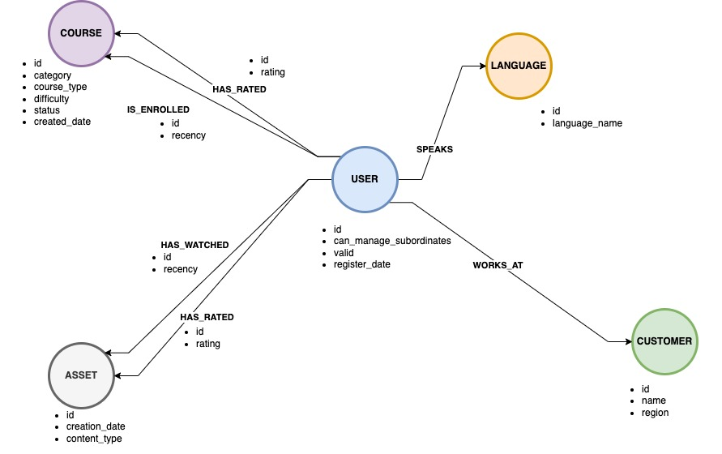
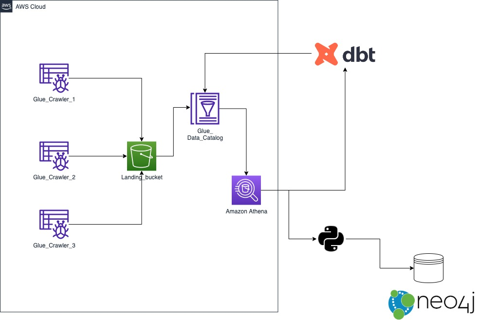

# Knowledge graph with DBT ETL pipeline

## Purpose/Goals

This project uses data from a LMS (Learning Management System) multi tenent platform.
The data can be divided into the following type of sources:

- **Users**
- **Assets** (ex: video, doc, excel, pdf, text, images,music, etc)
- **Courses** (a series of content with a common knowledge topic)

From the web [[1]](https://www.ontotext.com/knowledgehub/fundamentals/what-is-a-knowledge-graph/) a knowledge graph is:

```
..a collection of interlinked descriptions of concepts, entities, relationships and events. Knowledge graphs put data in context via linking and semantic metadata and this way provide a framework for data integration, unification, analytics and sharing.
```

The idea would be to model the entities and their relations into a graph database. What is provided is a series of fictional customers, each of them with their own SQL dumps that collect information.

Once the knowledge graph is formed, analytical queries can be run to discover pattern and anlyze behaviours inter/intra customers.

The tool used for the project are:

- [Neo4j](https://neo4j.com/): a native graph data store built from the ground up to leverage not only data but also data relationships. Unlike other types of databases, Neo4j connects data as it's stored, enabling queries never before imagined, at speeds never thought possible.
- [DBT](https://docs.getdbt.com/): enables analytics engineers to transform data in their warehouses by simply writing select statements. dbt handles turning these select statements into tables and views.
- [AWS Athena](https://aws.amazon.com/athena/?whats-new-cards.sort-by=item.additionalFields.postDateTime&whats-new-cards.sort-order=desc): is an interactive query service that makes it easy to analyze data in Amazon S3 using standard SQL. Athena is serverless, so there is no infrastructure to manage, and you pay only for the queries that you run.
- [AWS Glue](https://aws.amazon.com/glue/?whats-new-cards.sort-by=item.additionalFields.postDateTime&whats-new-cards.sort-order=desc): is a serverless data integration service that makes it easy to discover, prepare, and combine data for analytics, machine learning, and application development.
- [Terraform](https://www.terraform.io/): an infrastructure as code (IaC) tool that allows you to build, change, and version infrastructure safely and efficiently. This includes both low-level components like compute instances, storage, and networking, as well as high-level components like DNS entries and SaaS features.

## Graph data model



## Main design

### Terraform AWS deployment

The project begins with a series of data divided by three fake customers hosted on:

```
- data/customer_1
- data/customer_2
- data/customer_3
```

Via `terraform apply --auto-approve` command the following infrastructure is generated:



The deployment takes care of creating the correct resources and later upload the files onto the `landing_bucket`. The last step of the process will run one Glue Crawler for each customer to create some tables tat will be queried via AWS Athena.

Once the tables are generated inside the AWS Glue Catalog, it is possible to query the data via AWS Console or via third-party tool (ex: DBeaver).

I leverage the `Terraform workspaces` to separate dev/stage/prod environments. For this project only `dev` is set up to work with DBT.

### DBT workflow

DBT is a framework that leveraged SQL to transform the data from a source to a destination. In this project both source and destination are Athena databases hosted onto [AWS Glue Catalog](https://docs.aws.amazon.com/athena/latest/ug/glue-athena.html).

This library can provide any functionalities largely covered on their website. For now I have created models that will cater for these functions:

- Metadata collections for the main entities (ex: Users, Assets, User Languages and Courses).
- Interaction data between different entities, like user-asset or user-course interactions.

The `profile.yml` to connect DBT to the main datasource is set up locally on my machine. Please refer to this [page](https://github.com/Tomme/dbt-athena#configuring-your-profile) to configure your file with AWS Athena.

### Neo4j database

Neo4j is a graph database that can host many records along with its relations. It 's quite scalable and can provide a stable experience for such use case.

There are my ways to deploy a Neo4j instance (ex: Docker, Kubernetes), but the one chosen here is via [Sandbox](https://sandbox.neo4j.com/).

This is a free cloud deployment offered by Neo4j itself. It lasts for 3 days and can be extended once for 7 days. It is accessible only via registration on Neo4j, which is free of charge as well.

During the creation of the Sandbox, choose a blank instance since data will be uploaded later on.
Keep the window open to copy any useful setting later on.

## Data assumptions

Some assumptions have been made for the project:

- Data is anonymized.
- The file type is partitioned Parquet.
- Each Athena table is modelled inside `./models/sources.yml`.
- Each source contains basic tests that can be run via DBT. Primary keys and "not null" are specified where needed.
- The models are declared inside `./models/models.yml`.
- Any table with suffix `_history` reflect interactions.
- Any table with suffic `_details` reflect metadata.
- Not all customers use **Assets**, but everyone use **Courses**.
- The language is derived from the user set of a customer, not the items set.
- Code inside `./macros` is used to avoid duplication across model definitions.

### Initial data processing

To start, run :

```
cd deployment
terraform workspace select dev | terraform workspace new dev
terraform init
terraform apply --auto-approve
```

Once the infrastructure has been set up via Terraform and the Glue Crawlers have been run on all customers, the tables are visible by DBT to transform the data.

## Alternative scenarios

1. _What if the data was increased by 100x?_
2. _What if the pipelines were run on a daily basis by 7am?_

3. _What if the database needed to be accessed by 100+ people?_

## How to run the project

Begin with:

```
cd ..
poetry run dbt debug
```

we can make sure that the `profile.yml` file is correct and allows DBT to connect to the data warehouse.

Run:

```
poetry run dbt run
```

to perform all the transformations via DBT and create a new Glue Database (`dbt_fgasta_dev`).

Make sure that an empty Neo4j Sandbox is running. Annotate the instance URI and change it into `.scripts/etl_into_neo4j.py` at line 127, while the password has to be changed at line 129 of the script.

To perform the ETL from the new AWS Athena tables, run:

```
cd scripts
poetry run python etl_into_neo4j.py
```

Once the process is completed, log inside the Sandbox and perform some Cypeher queries.

### Prerequisites

Before running the project, the user must satisfy these requirements:

- Git v2.30+
- Poetry v1.1.14
- Python v3.9
- Terraform >=0.14
- An AWS profile configured on the machine.

## Files in the repo

Important files in the repository are:

- _.data_: contains raw data for the project.
- _.scripts/etl_into_neo4j.py_: simple Python script to load relational data into Neo4j.
- _.models_: contains DBT models and tests.
- _./dbt_project.yml_: DBT project settings.
- _.macros_: functions used on DBT models to compute recency and to verify if the table is present for a particular customer inside the data warehouse.
- _./deployment/main.tf_: terraform deployment file.
